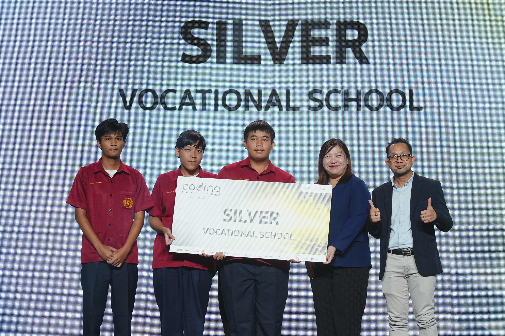
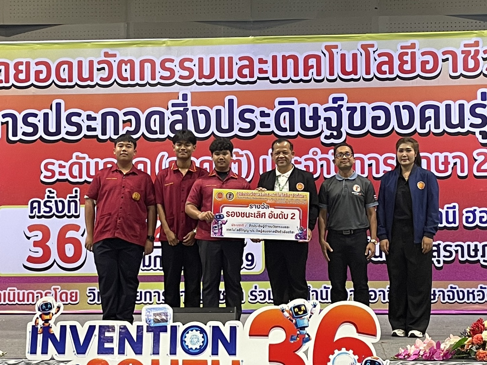
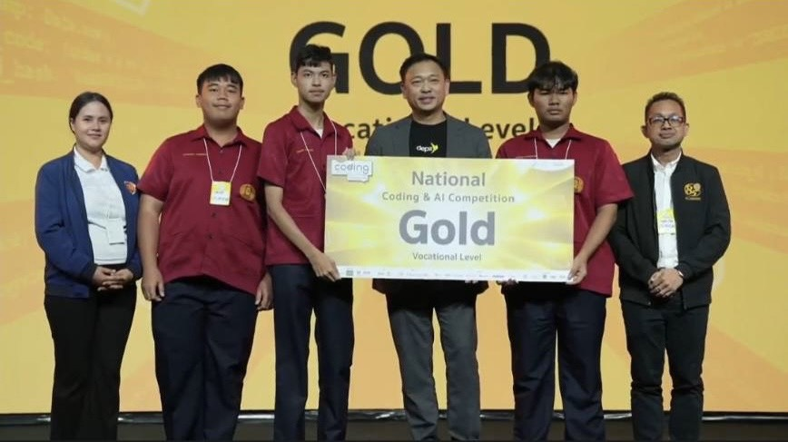

# Hello I'm Petch 💎💎💎
I am a 2nd-year IT Vocational Certificate student based in Phuket, Thailand.

## About Me
I am deeply passionate about technology, software architecture, and programming. I am a daily Linux user with a strong interest in building efficient systems. My coding journey started at 11 years old by creating datapacks for Minecraft, which sparked my love for logic and development. Since then, I have expanded my skills across various languages and frameworks.

### Currently, I focus on:
🕸 Web Development
👨‍💻 Full Stack Development
🔧 IoT & Hardware Integration

---

## Tech Skills

- Languages: Python (Advanced), JavaScript/TypeScript (Advanced), Java, C++
- Backend & API: Node.js, RESTful APIs, Fastify
- Frontend: React, ViteJS
- DevOps & Tools: Docker, Linux Administration, Git
- Security: Basic Penetration Testing & Vulnerability Analysis

### Currently Learning:
Machine Learning Architecture, Microservices & Multi-service integration.

---

## Project
- MimirRAG (Bot trade)
- OnYourLand (Sell pixel on website)
- JongNa (Reserve room)
- PhuketWasteApp (WebApp (Vibe code for Depa))
- Smart Parking System (AI checking parking lot)
- RAG (RAG for agent)
- Old Door Webshop (Minecraft server webshop)

---

## Certificate
Depa National AI coding & Competition 2025

National Thailand Inovation Vocation 2025

Depa National AI coding & Competition 2026

---

## Contact
### [Link tree](https://linktr.ee/hnmpetch)

> HNM Studio
